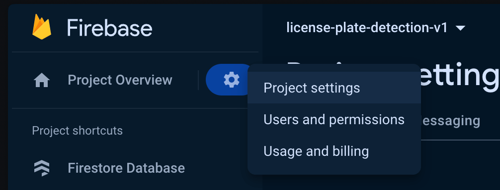
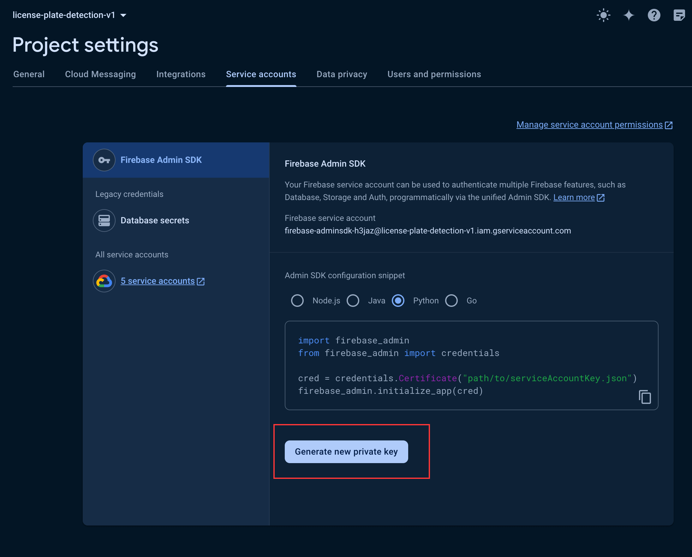

<h1>License Plate Detection</h1>

A super simple prototype of a license plate detection application.

Built with:

- PySide6 - GUI
- OpenCV - For image transformations
- YoloV5 - For detections (Might upgrade to YoloV8)
- EasyOCR - for OCR detection
- Firebase - For cloud data storage.

<h2>Table of Contents</h2>

- [📝 Running Requirements](#%F0%9F%93%9D-running-requirements)
- [🏁 Getting Started](#%F0%9F%8F%81-getting-started)
- [Resources](#resources)
- [Notes](#notes)

## 📝 Running Requirements

- Install [Git](https://git-scm.com/downloads) - On Mac it's already installed.
- Install [Python 3.12.2](https://www.python.org/downloads/)

## 🏁 Getting Started

Open your terminal and do the following:

1. Git clone and go to directory

```sh
git clone https://github.com/Blankeos/license-plate-detection
cd license-plate-detection
```

2. Create Virtual Env:

```sh
python -m venv .venv
```

2. Activate Virtual Env:

```sh
# macOS/Linux
source .venv/bin/activate

# Windows
.venv\Scripts\activate
```

3. Install Deps

```sh
# Install deps for the project.
pip install -r requirements.txt

# Install deps for the model.
git clone https://github.com/ultralytics/yolov5
pip install -r yolov5/requirements.txt
```

4. Create a file called `serviceAccount.json` in the root and paste your **Firebase Project Service Credentials**

   > This data is sensitive. Protect it or you risk getting spammed on Firebase.

    <details>
    
    <summary>💡 How to generate it.</summary>

   1. Go to project settings in Firebase.
      

   2. Generate private key.
      

   3. Rename it to `serviceAccount.json`
      ```jsonc
      // Example `serviceAccount.json`
      {
        "type": "service_account",
        "project_id": "project-id-here",
        "private_key_id": "private-key-id-here",
        "private_key": "private-key-here",
        "client_email": "license-plate-detection-v1-ser@project-id-here.iam.gserviceaccount.com",
        "client_id": "123456789101112131415",
        "auth_uri": "https://accounts.google.com/o/oauth2/auth",
        "token_uri": "https://oauth2.googleapis.com/token",
        "auth_provider_x509_cert_url": "https://www.googleapis.com/oauth2/v1/certs",
        "client_x509_cert_url": "https://www.googleapis.com/robot/v1/metadata/x509/subdomain.iam.gserviceaccount.com",
        "universe_domain": "googleapis.com"
      }
      ```

    </details>

5. Run the app (It will take a while the first run)

```sh
python main.py
```

## Resources

https://realpython.com/python-pyqt-gui-calculator/

## Notes

- We use an existing YoloV5 model `best.pt` from this repo: [here](https://github.com/KALYAN1045/Automatic-Number-Plate-Recognition-using-YOLOv5/blob/main/Weights/best.pt).
